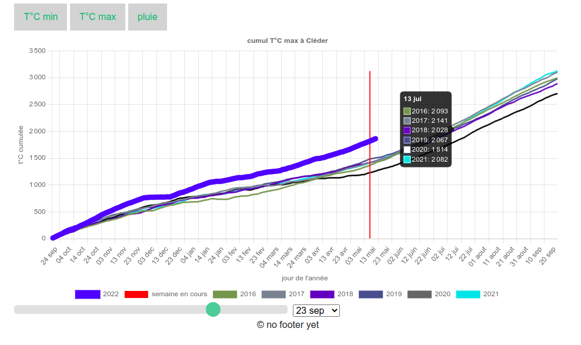
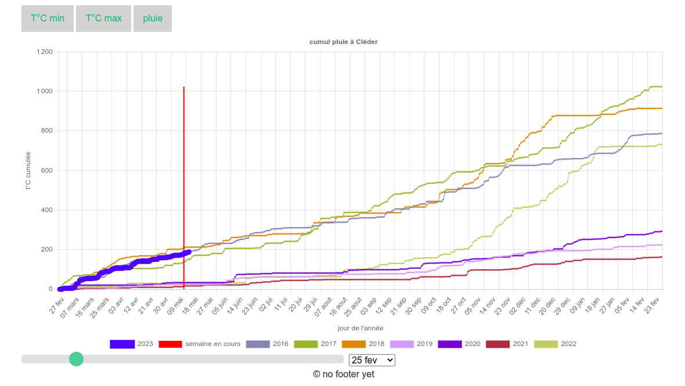

# cumuls météo

Dataviz en javaScript, avec un simple serveur Flask (python) et une base de données Postgresql. 

Le graphique permet de visualiser les cumuls de température et de pluviométrie actuels comparés aux cumuls des années passées. Il y a trois variables disponibles, la température minimale observée par jour, la température maximale, la pluviométrie cumulée sur 24h.

Un Slider et une liste déroulante permettent de choisir différents fenêtrages, pour que le cumul se calcule à partir de n'importe quel jour de l'année. 

Le graphique interactif est créé avec ChartJs.  

Pour installer l'application : 

> docker-compose up -d --build  

Pour la visualisation : 

> http://localhost:8123/

